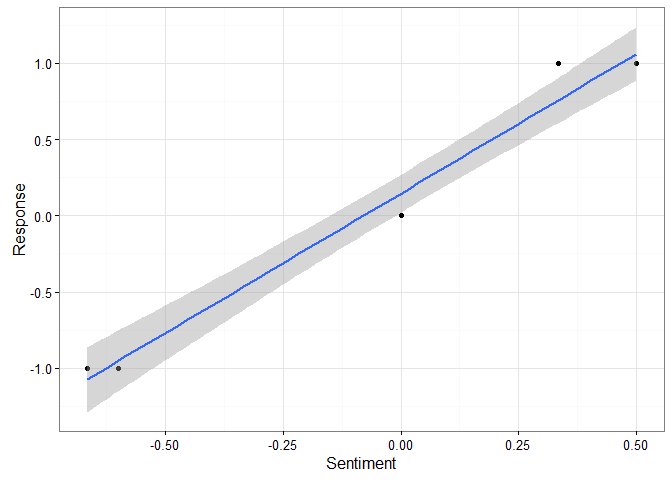

<!-- README.md is generated from README.Rmd. Please edit that file -->
Sentiment Analysis
==================

[](https://travis-ci.org/sfeuerriegel/SentimentAnalysis) [](https://cran.r-project.org/package=SentimentAnalysis) [](https://codecov.io/github/sfeuerriegel/SentimentAnalysis?branch=master)

**SentimentAnalysis** performs a **sentiment analysis** of textual contents in R. This implementation utilizes various existing dictionaries, such as General Inquirer, Harvard IV or Loughran-McDonald. Furthermore, it can also create customized dictionaries. The latter uses LASSO regularization as a statistical approach to select relevant terms based on an exogenous response variable.

Overview
--------

The most important functions in **SentimentAnalysis** are:

-   Compute sentiment scores from contents stored in different formats with `analyzeSentiment()`.

-   If desired, convert the continuous scores to either binary sentiment classes (negative or positive) or tertiary directions (negative, neutral or positive). This conversion can be done with `convertToBinary()` or `convertToDirection()` respectively.

-   Compare the calculated sentiment socres with a baseline (i.e. a gold standard). Here, `compareToResponse()` performs a statistical evaluation, while `plotSentimentResponse()` enables a visual comparison.

-   Generate customized dictionaries with the help of `generateDictionary()` as part of an advanced analysis. However, this prerequisites a response variable (i.e. the baseline).

To see examples of these functions in use, check out the help pages, the demos and the vignette.

Installation
------------

Using the **devtools** package, you can easily install the latest development version of **SentimentAnalysis** with

``` r
install.packages("devtools")

# Option 1: download and install latest version from ‘GitHub’
devtools::install_github("sfeuerriegel/SentimentAnalysis")

# Option 2: install directly from bundled archive
# devtoos::install_local("SentimentAnalysis_1.1.0.tar.gz")
```

Notes:

-   In the case of option 2, you have to specify the path either to the directory of **SentimentAnalysis** or to the bundled archive **SentimentAnalysis\_1.0.0.tar.gz**

-   A CRAN version has not yet been released.

Usage
-----

This section shows the basic functionality of how to perform a sentiment analysis. First, load the corresponding package **SentimentAnalysis**.

``` r
library(SentimentAnalysis)
```

### Quick demonstration

This simple example shows how to perform a sentiment analysis of a single string. The result is a two-level factor with levels "positive" and "negative."

``` r

# Analyze a single string to obtain a binary response (positive / negative)
sentiment <- analyzeSentiment("Yeah, this was a great soccer game of the German team!")
convertToBinaryResponse(sentiment)$SentimentGI
#> [1] positive
#> Levels: negative positive
```

### Small example

The following demonstrates some of the functionality provided by **SentimentAnalysis**. It also shows its visualization and evaluation capabilities.

``` r
# Create a vector of strings
documents <- c("Wow, I really like the new light sabers!",
               "That book was excellent.",
               "R is a fantastic language.",
               "The service in this restaurant was miserable.",
               "This is neither positive or negative.",
               "The waiter forget about my a dessert -- what a poor service!")

# Analyze sentiment
sentiment <- analyzeSentiment(documents)

# Extract dictionary-based sentiment according to the Harvard-IV dictionary
sentiment$SentimentGI
#> [1]  0.3333333  0.5000000  0.5000000 -0.6666667  0.0000000 -0.6000000

# View sentiment direction (i.e. positive, neutral and negative)
convertToDirection(sentiment$SentimentGI)
#> [1] positive positive positive negative neutral  negative
#> Levels: negative neutral positive

response <- c(+1, +1, +1, -1, 0, -1)

compareToResponse(sentiment, response)
#> Warning in cor(sentiment, response): the standard deviation is zero
#> Warning in cor(x, y): the standard deviation is zero

#> Warning in cor(x, y): the standard deviation is zero
#> Warning in cor(sentiment, response): the standard deviation is zero
#>                              WordCount SentimentGI NegativityGI
#> cor                        -0.18569534   0.9900115  -0.99748901
#> cor.t.statistic            -0.37796447  14.0440465 -28.16913204
#> cor.p.value                -0.37796447  14.0440465 -28.16913204
#> lm.t.value                 -0.37796447  14.0440465 -28.16913204
#> r.squared                   0.03448276   0.9801228   0.99498433
#> RMSE                        3.82970843   0.4501029   1.18665418
#> MAE                         3.33333333   0.4000000   1.10000000
#> Accuracy                    0.66666667   1.0000000   0.66666667
#> Precision                          NaN   1.0000000          NaN
#> Sensitivity                 0.00000000   1.0000000   0.00000000
#> Specificity                 1.00000000   1.0000000   1.00000000
#> F1                          0.00000000   0.5000000   0.00000000
#> BalancedAccuracy            0.50000000   1.0000000   0.50000000
#> avg.sentiment.pos.response  3.25000000   0.3333333   0.08333333
#> avg.sentiment.neg.response  4.00000000  -0.6333333   0.63333333
#>                            PositivityGI SentimentHE NegativityHE
#> cor                           0.9429542   0.4152274 -0.083045480
#> cor.t.statistic               5.6647055   0.9128709 -0.166666667
#> cor.p.value                   5.6647055   0.9128709 -0.166666667
#> lm.t.value                    5.6647055   0.9128709 -0.166666667
#> r.squared                     0.8891626   0.1724138  0.006896552
#> RMSE                          0.7136240   0.8416254  0.922958207
#> MAE                           0.6666667   0.7500000  0.888888889
#> Accuracy                      0.6666667   0.6666667  0.666666667
#> Precision                           NaN         NaN          NaN
#> Sensitivity                   0.0000000   0.0000000  0.000000000
#> Specificity                   1.0000000   1.0000000  1.000000000
#> F1                            0.0000000   0.0000000  0.000000000
#> BalancedAccuracy              0.5000000   0.5000000  0.500000000
#> avg.sentiment.pos.response    0.4166667   0.1250000  0.083333333
#> avg.sentiment.neg.response    0.0000000   0.0000000  0.000000000
#>                            PositivityHE SentimentLM NegativityLM
#> cor                           0.3315938   0.7370455  -0.40804713
#> cor.t.statistic               0.7029595   2.1811142  -0.89389841
#> cor.p.value                   0.7029595   2.1811142  -0.89389841
#> lm.t.value                    0.7029595   2.1811142  -0.89389841
#> r.squared                     0.1099545   0.5432361   0.16650246
#> RMSE                          0.8525561   0.7234178   0.96186547
#> MAE                           0.8055556   0.6333333   0.92222222
#> Accuracy                      0.6666667   0.8333333   0.66666667
#> Precision                           NaN   1.0000000          NaN
#> Sensitivity                   0.0000000   0.5000000   0.00000000
#> Specificity                   1.0000000   1.0000000   1.00000000
#> F1                            0.0000000   0.3333333   0.00000000
#> BalancedAccuracy              0.5000000   0.7500000   0.50000000
#> avg.sentiment.pos.response    0.2083333   0.2500000   0.08333333
#> avg.sentiment.neg.response    0.0000000  -0.1000000   0.10000000
#>                            PositivityLM RatioUncertaintyLM SentimentQDAP
#> cor                           0.6305283                 NA     0.9865356
#> cor.t.statistic               1.6247248                 NA    12.0642877
#> cor.p.value                   1.6247248                 NA    12.0642877
#> lm.t.value                    1.6247248                 NA    12.0642877
#> r.squared                     0.3975659                 NA     0.9732526
#> RMSE                          0.7757911          0.9128709     0.5398902
#> MAE                           0.7222222          0.8333333     0.4888889
#> Accuracy                      0.6666667          0.6666667     1.0000000
#> Precision                           NaN                NaN     1.0000000
#> Sensitivity                   0.0000000          0.0000000     1.0000000
#> Specificity                   1.0000000          1.0000000     1.0000000
#> F1                            0.0000000          0.0000000     0.5000000
#> BalancedAccuracy              0.5000000          0.5000000     1.0000000
#> avg.sentiment.pos.response    0.3333333          0.0000000     0.3333333
#> avg.sentiment.neg.response    0.0000000          0.0000000    -0.3666667
#>                            NegativityQDAP PositivityQDAP
#> cor                           -0.94433955      0.9429542
#> cor.t.statistic               -5.74114834      5.6647055
#> cor.p.value                   -5.74114834      5.6647055
#> lm.t.value                    -5.74114834      5.6647055
#> r.squared                      0.89177719      0.8891626
#> RMSE                           1.06840137      0.7136240
#> MAE                            1.01111111      0.6666667
#> Accuracy                       0.66666667      0.6666667
#> Precision                             NaN            NaN
#> Sensitivity                    0.00000000      0.0000000
#> Specificity                    1.00000000      1.0000000
#> F1                             0.00000000      0.0000000
#> BalancedAccuracy               0.50000000      0.5000000
#> avg.sentiment.pos.response     0.08333333      0.4166667
#> avg.sentiment.neg.response     0.36666667      0.0000000

plotSentimentResponse(sentiment$SentimentGI, response)
```



Dictionary generation
---------------------

Research in finance and social sciences nowadays utilizes content analysis to understand human decisions in the face of textual materials. While content analysis has received great traction lately, the available tools are not yet living up to the needs of researchers. This package implements a novel approach named "\*\*dictionary generation" to study tone, sentiment and reception of textual materials.

The approach utilizes LASSO regularization to extract words from documents that statistically feature a positive and negative polarity. This immediately reveals manifold implications for practitioners, finance research and social sciences: researchers can use R to extract text components that are relevant for readers and test their hypothesis based on these.

-   Proellochs, Feuerriegel and Neumann (2015): Generating Domain-Specific Dictionaries Using Bayesian Learning, Proceedings of the 23rd European Conference on Information Systems (ECIS 2015), Muenster, Germany. [DOI: 10.2139/ssrn.2522884](https://dx.doi.org/10.2139/ssrn.2522884)

License
-------

**SentimentAnalysis** is released under the [MIT License](https://opensource.org/licenses/MIT)

Copyright (c) 2016 Stefan Feuerriegel & Nicolas Pröllochs
